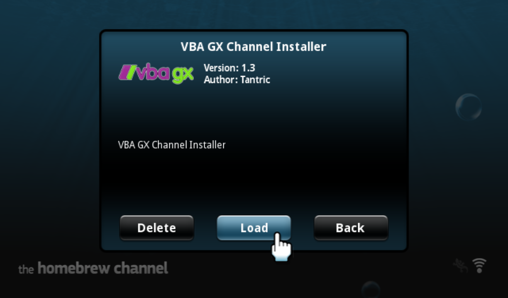
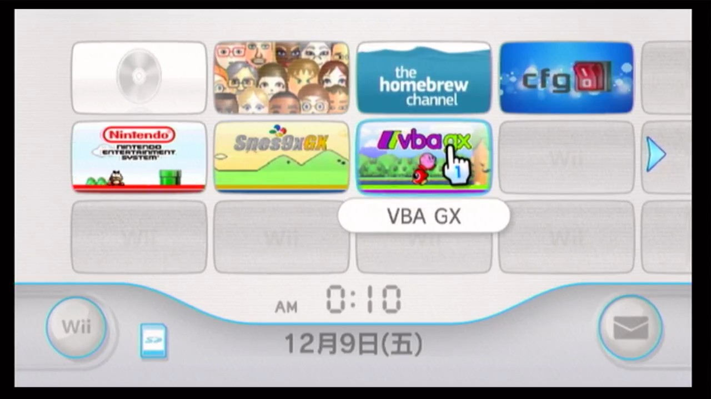
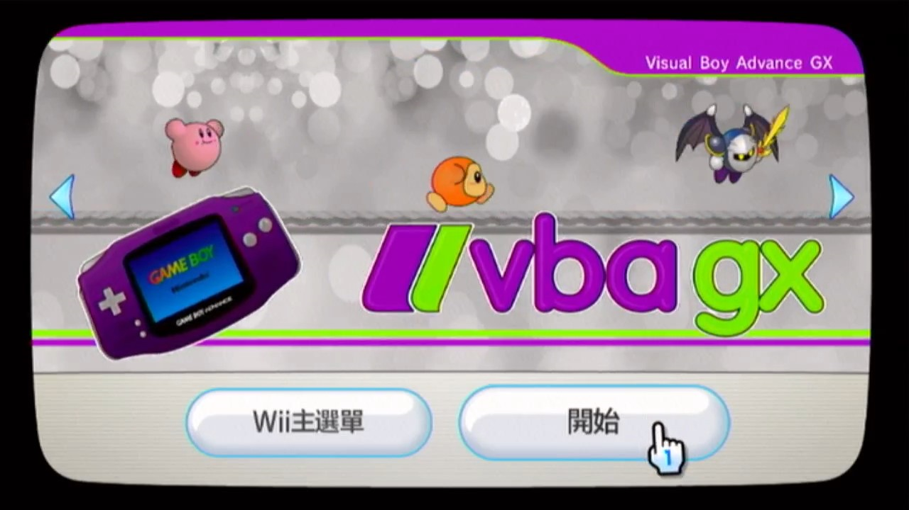
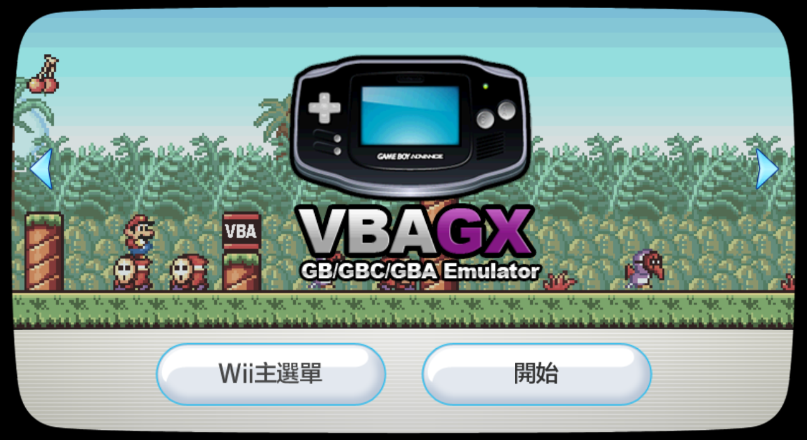
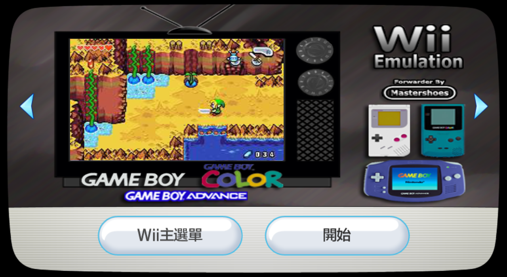

# VBA GX 频道一览


## 一、VbaGX-Channel-Installer.zip

官方提供的频道安装器是一个独立 APP。

使用步骤：

第 1 步，解压到 SD 卡或者 USB 设备的根目录。以 SD 卡为例，正确解压后，在 apps 文件夹里会多出一个名为 vbagx-channel-installer 的文件夹：

```
💾SD 卡:
 ┣ 📂apps
 ┃  ┗ 📂vbagx-channel-installer 
 ┗ readme.txt
```

第 2 步，在 HBC 中启动频道安装器 APP，按照提示操作，即可完成频道的安装：




第 3 步，安装成功后，即可直接通过 Wii 频道来启动 VBA GX。界面效果如下：

| Icon | Banner |
| :---: | :---: |
|  |  |


## 二、Gameboy Advance [VBAZ].wad




## 三、VBA GX [VBGX].wad


